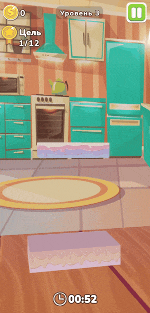

# Cake Tower 3D

**English** | [Русский](README.ru.md)

Genres: Arcade, Casual, Tower Building

**itch.io:** [Cake Tower 3D](https://nagibatoss.itch.io/cake-tower-3d)  
**APK:** [Download](https://disk.yandex.ru/d/gnrCYrMEjpGUSw)

  

## Description:
An original game where the player builds a tower out of cake blocks.
Each block keeps changing its size, growing and shrinking,
and when the player taps the screen, the block locks its size and falls onto the tower.
The falling block interacts with the other blocks of the tower and destroys the smaller ones.
The goal is to build a tower of the target height within a limited time.
The player loses if the tower blocks fall or the timer runs out.

  
  

## Key features:
- Block resizing mechanic with size locking on tap
- Smaller blocks are destroyed when a new block falls on them
- Stack-based tower implementation
- Events used for game reactions
- Game loop managed by a Finite State Machine

## Technologies and approaches:
- Component-based architecture
- Event-driven communication between game systems
- Finite State Machine for the game loop (menu, gameplay, win, lose)
- Dependency Injection with Zenject to manage dependencies between game systems
- Manager components to coordinate subsystems (audio, VFX, game logic)
- Object Pooling for tower blocks and effects (fewer Instantiate/Destroy calls)
- ScriptableObjects for data storage (levels, player progress, SFX settings)
- Saving and loading data (PlayerPrefs)
- Strategy pattern for choosing block spawn order
- Adaptive UI (Safe Area, support for different portrait screens)
- VFX, Particle System and scripted animations
- Music and sound effects
- Textures and visual design of game objects
- Performance profiling with Unity Profiler

## Possible improvements:
- Improve the scene setup (change the background, floor and tower position)
- Split TowerManager into smaller components (tower structure management, block "eating" logic)
- Make individual components more reusable
- Add adaptive UI for landscape orientation
- Standardize naming style and project structure
- Add saving and loading of settings
- Clean up unused assets
